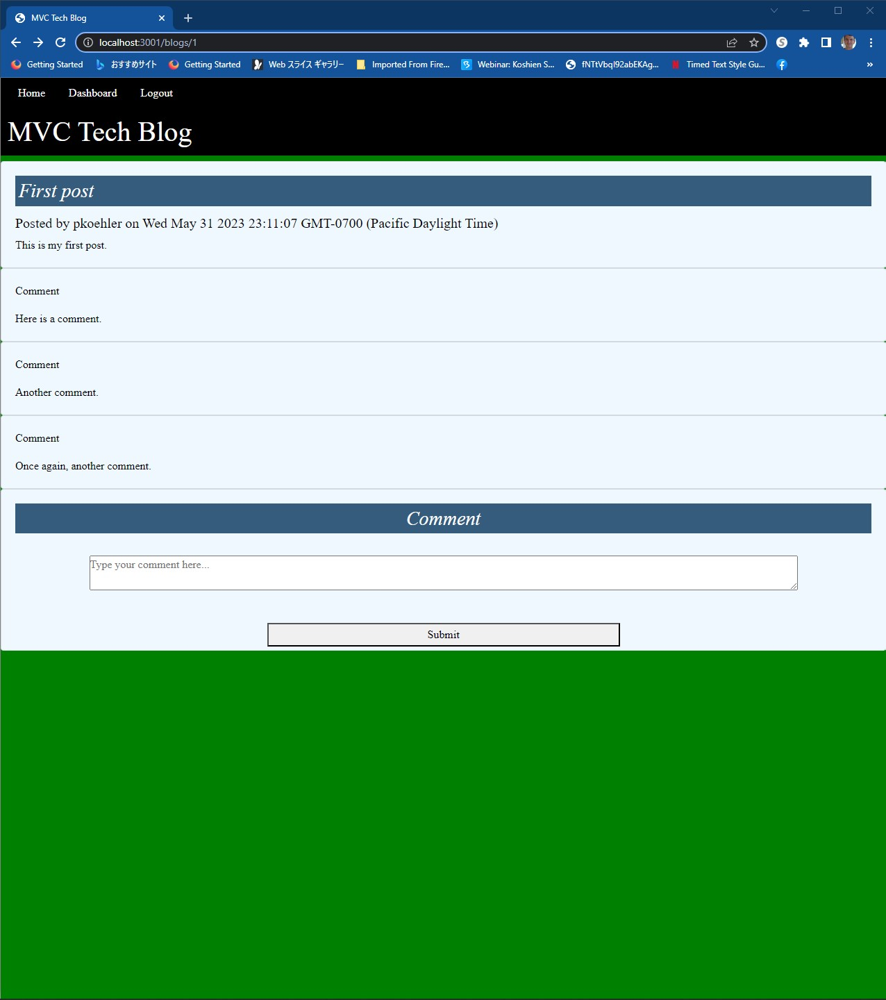

# MVC Tech Blog

## BADGE
 

## [DESCRIPTION](#description)
This application uses a variety of technologies to host a blog using the MVC framework and to manage user logins.

## SCREENSHOT

## TABLE OF CONTENTS

* [INSTALLATION](#installation)

* [USAGE](#usage)

* [LICENSE](#license)

* [CONTRIBUTING](#contributing)

* [TESTS](#tests)

* [QUESTIONS](#questions)

## [INSTALLATION](#installation)
Install express.js, node, MySQL, Sequelize, dotenv, bcrypt, express-session, express-handlebars, and connect-session-sequelize via NPM.

## [USAGE](#usage)
Make sure to run the command "npm run resetdb" to reset the database before running the app, then load the app through the URL http://tech-blog-mvc-pjk.herokuapp.com or by the command "npm run start"

## [LICENSE](#license)
MIT

## [CONTRIBUTING](#contributing)
Please contact the author at paul.koehler@gmail.com

## [TESTS](#tests)
Create a username and password to sign up with a unique id, then create a post and test the comment functions as needed.

## [QUESTIONS](#questions)
If you have any questions, please feel free to reach out to the author of this application at the following GitHub page and email address.

https://github.com/pk50sshowa

[paul.koehler@gmail.com](paul.koehler@gmail.com)
